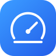
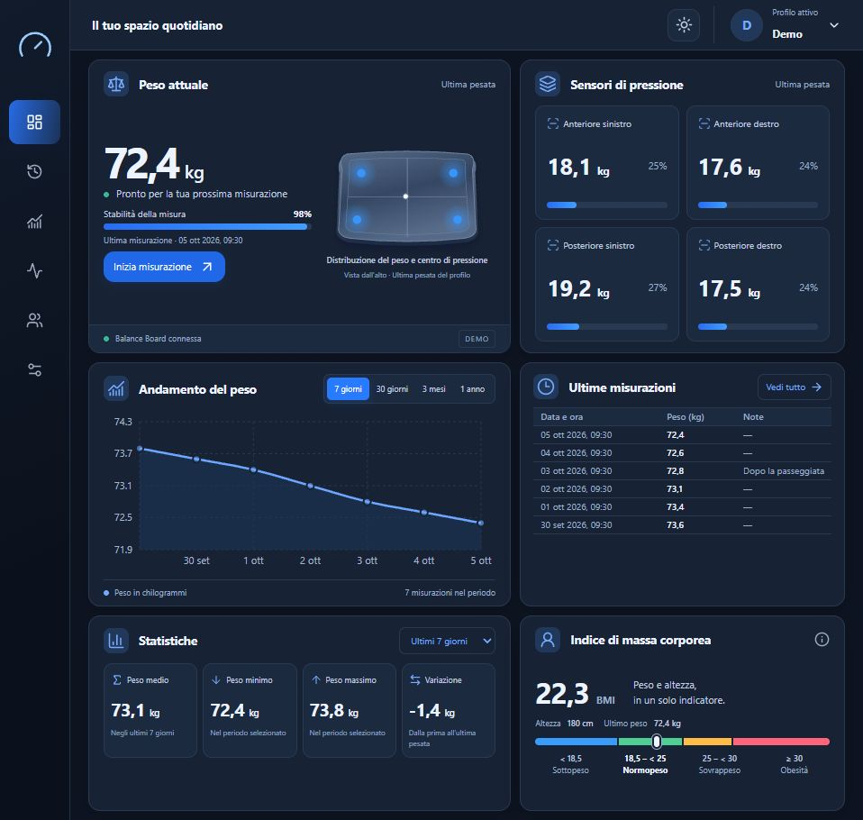

  

<h1 align="center">Gravia</h1>

<strong>Weight. Balance. Insight.</strong>

  La tua Wii Balance Board, una nuova abitudine. 
  Peso, equilibrio e progressi in uno spazio tutto tuo.

  <a href="docs/GUIDA_TECNICA.md#avvio-rapido"><strong>Inizia con Gravia →</strong></a>

La dashboard in modalità demo · Dati illustrativi

## La tua board. Una nuova abitudine.

Dai nuova vita alla **Nintendo Wii Balance Board**. Accendila, scegli il tuo profilo e sali: Gravia segue la pesata e salva il risultato quando la misura si stabilizza. Dal computer o dal telefono, ritrovi ogni giorno il tuo percorso.

## Tutto quello che conta, a colpo d’occhio

- **Il tuo peso, nel tempo.** Pesate, grafici e statistiche per seguire i cambiamenti e aggiungere le tue note.
- **Il tuo equilibrio, visibile.** Quattro sensori e una mappa della pedana mostrano come distribuisci il carico.
- **Un piccolo momento di Training.** Trova il centro con **Balance Hold**, segui i target di **Weight Shift** e cerca un appoggio uniforme con **Symmetry**. Ritrova risultati e record personali.
- **Uno spazio per ciascuno.** Profili separati, storico personale e dati conservati nella tua installazione.

## La luce che preferisci

Chiaro, scuro o automatico. Gravia si adatta al tuo schermo e alla luce della giornata, con un’interfaccia pensata anche per il telefono.

## Comincia da ciò che hai

Una Balance Board e un Raspberry Pi bastano per dare forma al tuo spazio. La calibrazione guidata ti aiuta a personalizzare le letture della pedana.

Vuoi prima conoscere Gravia? La **modalità demo** ti permette di esplorare la dashboard e provare pesate simulate e Training anche senza hardware.

<strong>Un piccolo gesto. Una nuova prospettiva.</strong>

---

  <a href="docs/GUIDA_TECNICA.md">Installazione</a> ·
  <a href="docs/TRAINING.md">Scopri Training</a> ·
  <a href="docs/POWER_LIFECYCLE.md">La tua Balance Board</a>

